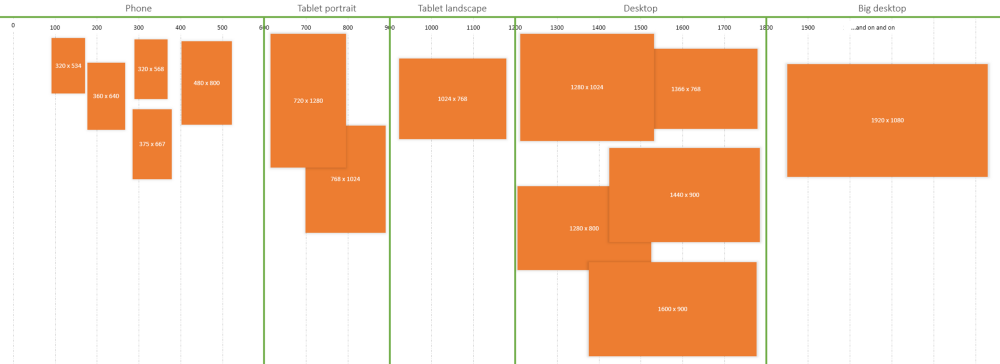

# Estudo das práticas de Desenvolvimento Responsivo

## Design Responsivo vs Adaptáve

...

## Breakpoints por intervalo

Novas sugestões de breakpoints pensando em intervalos que contenham grupos de dispositivos:

```
600px, 900px, 1200px, and 1800px
```



## Flexbox

O uso de flexbox permite pensar de forma mais simples a digramação de elementos que não estão necessariamente em uma grid.

Um exemplo é o uso de `space-around` e `space-between` que são bons candidatos para substituir uma grid com 2 ou 3 elementos que estão posicionados relativamente ao seu box.

- `space-between`: os itens são posicionados com espaço entre os elementos.
- `space-around`: os itens são posicionados com espaço antes, entre e depois dos elementos.

```css
.element {
  display: flex;
  justify-content: space-between;
}
```

## Escalonamento da fonte

Utilizar o seguinte modelo para definir o aumento e diminuição da fonte:

  - de 6px a 12px: +1
  - de 12px a 18px: +2
  - de 18px a 24px: +3
  - de 24px a 72px: +12

Por exemplo, caso você precise diminuir um titulo com tamanho 48px, vai diminuir 12px, ficando 36px e se precisar diminuir mais, diminui mais 12px ficando 24px.

## Controle do tamanho da fonte

No momento estou apenas usando a unidade `px` definida pelo layout, adaptando nas quebras.

E em alguns casos mais isolados, usando as unidades de viewport para não precisar fazer uma adaptaçã até algum breakpoint.


## Viewport units

O uso das seguintes unidades:

```
vw, vh, vmin, vmax
```

Ajuda a contruir um layout mais liquido de acordo com o tamanho ou da largura ou da altura.

## Referências

The 100% correct way to do CSS breakpoints
https://medium.freecodecamp.org/the-100-correct-way-to-do-css-breakpoints-88d6a5ba1862

9 responsive typography tips
https://www.creativebloq.com/rwd/expert-responsive-typography-tips-101517572

Padrões de Web design responsivo
https://developers.google.com/web/fundamentals/design-and-ux/responsive/patterns?hl=pt-br

The rules of responsive web typography 
https://www.creativebloq.com/how-to/the-rules-of-responsive-web-typography

Fundamentals of Motion Design
https://www.invisionapp.com/inside-design/fundamentals-of-motion-design/

Modality: the one ux concept you need to unsderstand when designing intuitive user interface
https://uxplanet.org/modality-the-one-ux-concept-you-need-to-understand-when-designing-intuitive-user-interfaces-e5e941c7acb1
